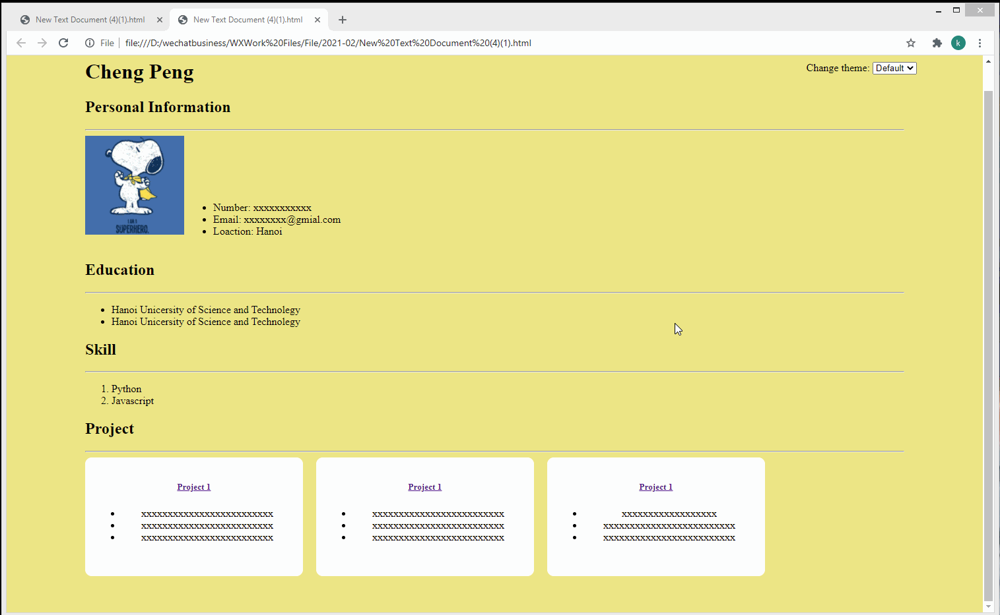

# HTML20210208

Practice HTML, CSS through building a simple HTML page.

**Requirements:**

1. The page must include the following sections:

    - a. Page Title section.  Practice to use **h1** **h2** elements;

    - b. Personal Information section.  Practice using **img**, **ul** and **li** elements;

    - c. Education section.  Practice using **ul** and **li** elements;

    - d. Skills section.  Practice using **ol** and **li** elements;

    - e. Projects section. The project cards should be responsive, you have two choices to implement responsive design, one is using **float** attribute, another one is setting display attribute to **inline-block** and setting width using **calc** function; 
 
    - f. Each section will have a title and a line under the title. Practice to use **h1** **h2** and **hr** elements

2. A "Change theme" function which provides 4 choices to end-user, default, red, green and yellow. the title and the line under the title's color will change according to the choice.

    - a. You can choose any technology which you are familiar with to implement this function, DOM API, JQuery or others

    - b. Practice using css **class** to control theme.

3. The following demostration is not perfect in responsive design, try to improve it.

    - For the width value, the percentage value and calc function rather than fixed size will help you to improve the responsive design.

    - You can use F12 or some extensions to test different resolutions.

4. Use some real text message instead of placeholder. "xxxx..." is **NOT qualified**.

5. **Make Sure** you finished the functions and styles in the demo before you add customizations or improvements.

##  
 

